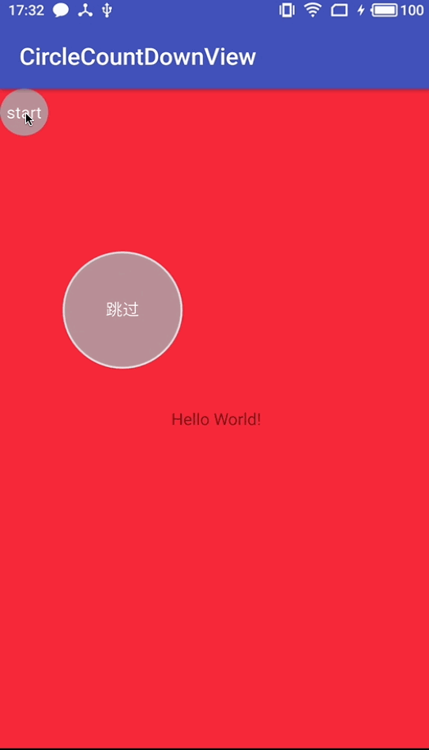

# CountDownProgress
倒计时进度动画展示



- cdp_circle_solid_color 内圆填充色
- cdp_circle_stroke_color 圆边框颜色
- cdp_circle_stroke_width 圆边框宽度
- cdp_progress_color 进度条颜色
- cdp_progress_width 进度条宽度
- cdp_text_color 文字颜色
- cdp_text_size 文字大小
- cdp_text 文案
- cdp_count_down_time 倒计时长
- cdp_start_degree 进度条的起始角度位置，（3点钟方向为 0 ，默认是12点方向 270）

圆的大小通过View的width 与 height 自动计算。

### 配置

```
compile 'com.sqq.xiaqu:countdownprogress:1.0.0'
```